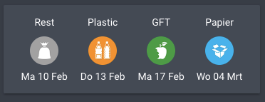

# RAD Hoekschewaard Afval Kalender

[](https://github.com/custom-components/hacs)
[](https://www.python.org/)
[](https://github.com/ellerbrock/open-source-badges/)

<a href="https://www.buymeacoffee.com/johnwulp" target="_blank"></a>

## Home Assisant sensor component for RAD Hoekschewaard Afval Kalender
Provides Home Assistant sensors for the Dutch waste collectors RAD Hoekschewaard 
Check your postalcode on https://www.radbv.nl/afvalkalender/

Source and images is copied from:
https://github.com/pippyn/Home-Assistant-Sensor-Afvalbeheer
https://github.com/xirixiz/Home-Assistant-Sensor-Afvalwijzer

## Install:
There are two ways to install:

### Manual:
- Copy the files in the /custom_components/rad-afval/ folder to: [homeassistant]/custom_components/rad-afval/
- Restart homeassistant

### HACS: 
- Find plugin under integration
- Restart homeassistant

## After install, create config:
Example config:
```Configuration.yaml:
sensor:
  - platform: rad-afval
    resources:
      - gft
      - papier
      - pmd
      - rest
    postalcode: 3262CD
    streetnumber: 5
    dateformat: '%a %d %b'
```

## New parameter companycode
Since dec 2020 the API has changed, and uses a new parameter called 'companycode'. The default value is always: '13a2cad9-36d0-4b01-b877-efcb421a864d' but can be changed to something else if needed in the configuration of the sensor.

Available resources:

- gft 'Gft-container'
- papier 'Papiercontainer (indien van toepassing)'
- pmd 'PMD - P(lastic)M(etaal)D(rinkpakken)'
- rest	'Restafvalcontainer'

### Date format
If you want to adjust the way the date is presented. You can do it using the dateformat option. All [python strftime options](http://strftime.org/) should work.
Default is '%d-%m-%Y', which will result in per example: 
```yaml
21-1-2020
```
If you wish to remove the year and the dashes and want to show the name of the month abbreviated, you would provide '%d %b'. Which will result in: 
```yaml
21 Jan
```
## Interface on frontend
For a great looking, and sortable card, please install https://github.com/thomasloven/lovelace-auto-entities


After installation you can use this in frontend:
```yaml
card:
  type: glance
filter:
  include:
    - entity_id: sensor.rad_hw_afval_restafval
    - entity_id: sensor.rad_hw_afval_pmd
    - entity_id: sensor.rad_hw_afval_oud_papier
    - entity_id: sensor.rad_hw_afval_gft
sort:
  attribute: next_pickup_in_days
  method: attribute
  numeric: true
type: 'custom:auto-entities'
```

I renamed the sensors to shorter one's with this in configuration.yaml:
```yaml
homeassistant:
  customize:
    sensor.rad_hw_afval_gft:
      friendly_name: GFT
    sensor.rad_hw_afval_oud_papier:
      friendly_name: Papier
    sensor.rad_hw_afval_pmd:
      friendly_name: Plastic
    sensor.rad_hw_afval_restafval:
      friendly_name: Rest
```

## Changelog
- Version: 0.0.1  20200210 - Initial Release
- Version: 0.0.2  20201229 - Changes for new API
- Version: 0.0.3  20210822 - Changed filter to include today for 'next_pickup_in_days' sensor. Value will be 0 if pickup is today